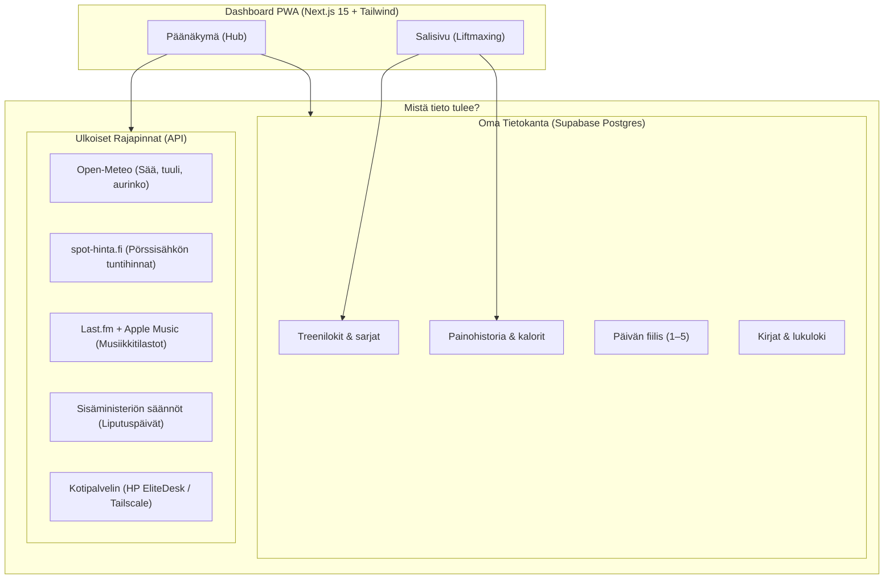

# Dashboard – Miten kaikki toimii?

Tämä on yhden ruudun henkilökohtainen dashboard (PWA), joka korvaa erilliset mobiilisovellukset, muistiot ja kirjanpidot yhdellä nopealla näkymällä.

Tässä on yksinkertainen kuvaus siitä, mistä kunkin osion data tulee ja miten kokonaisuus rakentuu.

---

## 1. Yleiskaavio (Miten palaset yhdistyvät)

```text
┌─────────────────────────────────────────────────────────────────────────┐
│                      PERSONAL DASHBOARD (PWA)                           │
│             Next.js 15 · React 19 · Tailwind CSS · Vercel               │
└─────────────────────────────────────────────────────────────────────────┘
                     │                                   │
       [ Omat kirjaukset & tila ]           [ Automaattiset API-rajapinnat ]
                     │                                   │
      ┌──────────────┴──────────────┐     ┌──────────────┴──────────────┐
      │                             │     │                             │
┌─────▼────────┐              ┌─────▼───┐ ├─► 🌤️ Sää (Open-Meteo)
│ 🏋️ Treenit   │              │ 😊 Mood │ │   Ilmainen sää-API, sijainti selaimessa
│   (Sali/Run) │              │ 📚 Kirjat│ ├─► ⚡ Pörssisähkö (spot-hinta.fi)
│ ⚖️ Paino     │              └─────┬───┘ │   Suomen tuntihinnat (alv 25,5 %)
└─────┬────────┘                    │     ├─► 🇫🇮 Liputuspäivät (Sisäministeriö)
      │                             │     │   Näkyy vain virallisena liputuspäivänä
      └──────────────┬──────────────┘     ├─► 🎵 Musiikki (Spotify + Last.fm + Apple)
                     │                    │   Toistot, minuutit, levyt & genret
               ┌─────▼──────┐             └─► 🖥️ Kotilab (HP EliteDesk)
               │  SUPABASE  │                 Koneen tila tunnelin läpi (offline)
               │ PostgreSQL │
               │ Auth + RLS │
               └────────────┘
```

### Sama Mermaid-kaaviona (visuaalinen renderöinti)



---

## 2. Osioiden esittely ja datalähteet

### 🏋️ 1. Sali & Treenit (Liftmaxing)
- **Mitä tekee:** Korvaa treenivihkon. Tukee splittejä (Push / Pull / Legs / Upper / Run). Autotallennus päällä koko ajan: painot ja toistot tallentuvat lennosta sarja kerrallaan.
- **Mistä tieto tulee:** Oma **Supabase PostgreSQL** -tietokanta (`workout_sessions`, `session_exercises`, `workout_logs`).
- **Fiksu juttu:** Voimakehityksen päämittarina käytetään **e1RM-arvoa** (arvioitu 1 toiston maksimi Epley-kaavalla). Eli jos teet 70 kg:lla 10 toiston sijaan 12 toistoa, kaavio tunnistaa heti kehityksen, vaikka itse tankopaino pysyi samana.

### ⚖️ 2. Paino ja Kehonkoostumus
- **Mitä tekee:** Päivittäinen aamupaino ja kalorit.
- **Mistä tieto tulee:** Supabase (`health_logs`).
- **Fiksu juttu:** Paino heilahtelee päivittäin nesteiden takia jopa 1–2 kg. Siksi sovellus ei tuijota eilistä, vaan laskee **liukuvan viikkotrendin** (kalenteriviikon keskiarvo). Hubi- ja salikortti näyttävät aina täsmälleen samaa tasaista viikkomuutosta (`-0.3 kg / vko`).

### 🎵 3. Musiikki & Kuuntelutilastot
- **Mitä tekee:** Näyttää viikon (`7d`), kuukauden (`1 mo`), puolen vuoden (`6 mo`) ja vuoden suosituimmat artistit, biisit, kuuntelutunnit ja levynkannet.
- **Mistä tieto tulee:** 
  1. Spotify lähettää jokaisen kuunnellun kappaleen automaattisesti taustalla **Last.fm** -tilille (*scrobble*).
  2. Dashboard kyselee Last.fm:n API:sta soittomäärät ja biisien pituudet -> laskee tarkan kuunteluajan tunteina ja minuutteina.
  3. Päägenre tunnistetaan ja täydennetään automaattisesti **Apple Music Search API:sta**.

### ⚡ 4. Pörssisähkö
- **Mitä tekee:** Näyttää kuluvan vuorokauden tuntikohtaiset sähkön spot-hinnat Suomessa ja korostaa kuluvan tunnin hinnan.
- **Mistä tieto tulee:** Ilmainen kotimainen **spot-hinta.fi** REST-rajapinta.
- **Fiksu juttu:** Pylväiden korkeus skaalautuu päivän hintavaihteluun ja väri kertoo kalleuden suoraan (vihreä ≤ 10 snt, oranssi < 20 snt, punainen ≥ 20 snt/kWh, sisältää alv 25,5 %).

### 🌤️ 5. Sää
- **Mitä tekee:** Lämpötila, tuuli, sade, sääkuvake sekä auringon nousu- ja laskuajat sekä päivän pituus.
- **Mistä tieto tulee:** **Open-Meteo API** (ilmainen, tarkka avoimen datan säämalli ilman API-avaimia).
- **Fiksu juttu:** Sijainti tallentuu selaimen muistiin (`localStorage`), joten säätiedot latautuvat heti ilman jatkuvia GPS-kyselyitä.

### 🇫🇮 6. Liputuspäivät
- **Mitä tekee:** Kertoo, miksi lippu liehuu salossa tänään.
- **Mistä tieto tulee:** Sisäministeriön viralliset ja vakiintuneet liputuspäivät suoraan koodin kalenterialgoritmissa (`lib/flag-days.ts`).
- **Fiksu juttu:** Kortti **ei ole tiellä turhaan**: se nousee näkyviin *ainoastaan* silloin, kun tänään on oikea liputuspäivä.

### 😊 7. Mieliala (Mood)
- **Mitä tekee:** Nopea 1–5 päiväarvio (1 = huono, 5 = loistava).
- **Mistä tieto tulee:** Supabase (`mood_logs`).
- **Fiksu juttu:** Renderöityy GitHub-tyyliseksi värikkääksi lämpökartaksi (heatmap), josta näkee yhdellä silmäyksellä miten viimeiset viikot ja kuukaudet ovat menneet.

### 📚 8. Kirjat
- **Mitä tekee:** Luettujen ja kesken olevien kirjojen seuranta sivumäärineen.
- **Mistä tieto tulee:** Supabase (`books`).

### 🖥️ 9. Kotilab (Homelab)
- **Mitä tekee:** Nopea vilkaisu kotipalvelimen tilaan (prosessori, muisti, levytila, ajossa olevat palvelut kuten Home Assistant tai Immich).
- **Mistä tieto tulee:** Kotona pyörivä HP EliteDesk mini-PC. Hakee tiedot suojatun Tailscale / Cloudflare -tunnelin kautta (kortti näyttää "Offline", kun tunneli ei ole aktiivinen).

---

## 3. Teknologiat pähkinänkuoressa

| Osa-alue | Teknologia | Miksi valittu? |
| --- | --- | --- |
| **Frontend** | Next.js 15 (App Router), React 19 | Nopea, moderni, tukee server- ja client-komponentteja |
| **Ulkoasu** | Tailwind CSS (Dark UI, `#004cff` brand) | Kevyt, mobiiliresponsiivinen ja helppo muokata |
| **Kaaviot** | Recharts | Sujuvat voimakäyrät ja painotrendit |
| **Tietokanta** | Supabase (PostgreSQL + RLS) | Oikea relaatiotietokanta, RLS-tietoturva (omat tiedot pysyvät suojassa) |
| **Deploy** | Vercel | Automaattinen julkaisu suoraan GitHubin `main`-haarasta sekunneissa |
| **Kustannukset** | **0 € / kk** | Kaikki palvelut pyörivät ilmaisen tason (Free tier) rajoissa ilman mainoksia tai datankeruuta |
